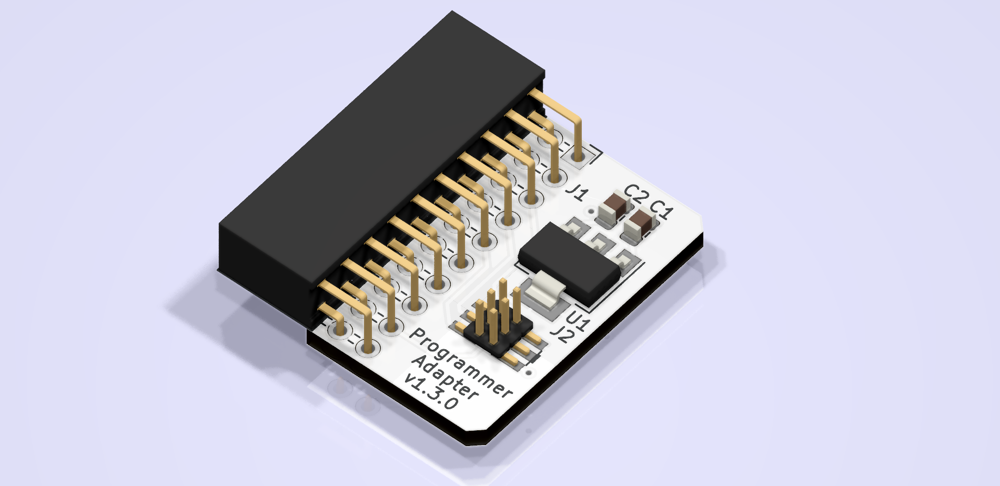

<!--
Add one of this in front of the title

-->

# Programmer Adapter 

This board interfaces the SEGGER JLink to the boards of this collection

## SEGGER JLink
SEGGER J-Links are the most commonly used line of debug probes nowadays. Their growing popularity is the fruit of their high performance, the large number of CPUs they support, as well as development environments, and also their huge feature set. SEGGER J-Links have been available for more than 10 years, and in this period they've proven their resilience in the debug probes market.

## Features
### Functional

- Program and debug device
- Power the device through this board

### Technical

- None

<!--- DON'T CHANGE BELLOW THIS LINE -->

## Not working?
Please file an issue with all the details you can provide and we will fix it for you.

## Contributing
You are free to reach out and report issues, fix bugs and suggest new features as well as submit pull-requests.

## License
You can use this at your will provided that you mention us properly by including a link to this page. For further information, consult the [LICENSE](LICENSE) file.
